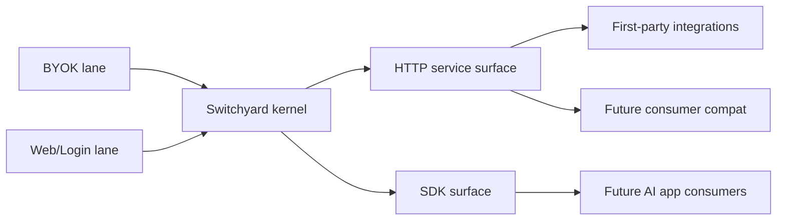

# Switchyard

**Shared provider runtime for AI apps.**

Switchyard turns end-user `BYOK + Web/Login` access into one service-first
runtime that AI products can call without rebuilding provider routing,
credential/session handling, and diagnostics from scratch.

It is **not** a chat product, **not** a personal assistant, and **not** another
all-in-one AI platform. It exists to be the shared runtime layer that other AI
apps can depend on.

<p align="center">
  
</p>

<p align="center">
  
</p>

## Builder Thesis

> **One shared provider runtime for AI apps.**
>
> Use Switchyard when you want AI products to plug into real end-user access
> lanes without every product re-inventing provider contracts, session logic,
> and diagnostics.

## Current Public Boundary

Today the truthful public story is:

- **Primary public front door**: the GitHub Pages docs atlas plus this root
  README
- **Primary repo-native runtime surface**: `apps/service/` and the
  service/runtime HTTP contract
- **Secondary machine-readable surface**:
  `packages/surfaces/mcp/server.json`, a **read-only MCP descriptor**
- **Builder-facing packet**:
  `distribution/claude-marketplace/plugins/switchyard-builder-suite/skills/runtime-diagnostics/`
  plus starter packs and host examples
- **Not claimed today**: official marketplace listings, official MCP Registry
  listing, npm publication, hosted multi-tenant runtime, write-capable MCP, or
  full consumer parity

Artifact-ready still does **not** mean listed-live.

## Public Language Policy

Switchyard now treats the public front door as **English-first**.

- The default landing path for global developers stays English-first.
- Bilingual support remains available through glossary and i18n helper pages.
- Live/browser realism notes belong in proof and runbook surfaces, not in the
  stable top-level product sentence.

## Open The Right Door

| If you need to... | Open this first |
| --- | --- |
| understand the product in 30 seconds | [docs/media/30-second-overview.md](./docs/media/30-second-overview.md) |
| run the shortest first success | [docs/first-success.md](./docs/first-success.md) |
| inspect what is really proved today | [docs/public-proof-pack.md](./docs/public-proof-pack.md) |
| see what is package-ready vs listed-live | [docs/public-distribution-ledger.md](./docs/public-distribution-ledger.md) |
| see the exact heavy-lane submission packet | [docs/submission-packet-ledger.md](./docs/submission-packet-ledger.md) |
| browse the full docs atlas | [docs/index.html](./docs/index.html) and [docs/README.md](./docs/README.md) |

## 30-Second Version

If you only remember four lines, remember these:

1. Switchyard is **not** another AI app.
2. It is a **shared provider runtime for AI apps**.
3. It turns `BYOK + Web/Login` access into a service-first substrate that other
   AI products can call.
4. Today it ships a repo-native runtime, a partial read-only MCP surface, a
   runtime-diagnostics packet, starter packs, and truth-first public docs. npm,
   registry, marketplace, Docker, and broader publication remain later lanes.

## First Success

If you want the fastest truthful first success, run the shortest bounded path:

1. Start the local runtime:

   ```bash
   pnpm run start:service-local
   ```

2. Prove the read-only truth surface is alive:

   ```bash
   pnpm run example:mcp-inspector
   ```

3. Prove the runtime can accept one minimal invoke:

   ```bash
   pnpm run example:runtime-bridge
   ```

The default service port is `http://127.0.0.1:4010`.

If you want the full step-by-step path and failure routing, open
[docs/first-success.md](./docs/first-success.md).

## Why Switchyard Exists

Many AI products keep rebuilding the same messy layer:

- provider contracts
- auth/session plumbing
- provider routing
- diagnostics and remediation
- builder starter surfaces

Switchyard exists so that this repeated work can become one reusable runtime:

> **a shared provider runtime that AI apps can plug into, instead of each app
> re-inventing the provider layer alone**

## What It Is

- a shared provider runtime for AI apps
- a service-first runtime surface with SDK and MCP companion surfaces
- a builder-facing repo that keeps proof, starter packs, and truth contracts
  aligned
- a runtime layer that stays fail-closed on claims it cannot honestly prove

## What It Is Not

- not a chat product
- not a personal assistant
- not a control-plane-first SaaS
- not a hosted multi-tenant runtime today
- not a browser plugin
- not a raw fork product of any upstream repo

## V1 Scope

Switchyard V1 is intentionally narrow:

- `BYOK`
- `Web/Login`

Current Web/Login provider set:

1. `ChatGPT`
2. `Gemini`
3. `Claude`
4. `Grok`
5. `Qwen`

Current BYOK code support must cover:

- `OpenAI`
- `Anthropic`
- `Grok / xAI`
- `OpenRouter`
- `Groq`
- `Qwen API`
- `Vertex AI`
- `Bedrock`

Explicit non-goals right now:

- `Agent Input Lane`
- `Codex` / `Claude Code` as supply-side sources
- `Gemini CLI`
- shared public credentials
- multi-tenant account pooling
- a hosted control plane

## Architecture In One Sentence

Switchyard separates **lane**, **provider**, **consumer**, and **surface** so
that the runtime stays reusable even while builder routes and public claims stay
fail-closed.

High-level shape:



## What Ships Now vs Later

### Ships now

- service-first runtime surface
- partial read-only MCP surface
- partial thin compat packages
- runtime-diagnostics public skill packet
- starter packs and host examples
- proof-first docs atlas and public distribution ledger

### Still later

- official marketplace listings
- official MCP Registry listing
- npm publication read-back
- Docker/runtime catalog publication
- hosted multi-tenant runtime
- full consumer parity
- write-capable MCP

## Proof And Reality Truth

Live/browser outcomes are important, but they are **proof / runbook truth for a
credentialed workstation**, not the stable repo identity.

That means:

- repo-side green does not erase local browser/session blockers
- one workstation result should not rewrite the top-level product sentence
- current live/browser reality belongs in
  [docs/public-proof-pack.md](./docs/public-proof-pack.md)
  and [docs/runbooks/dev-bootstrap.md](./docs/runbooks/dev-bootstrap.md)

Use the proof pack when the question becomes:

- what is really proved today
- which blockers are external-only
- which results depend on local credentials and browser session materials

## Distribution Truth

Current distribution truth is intentionally narrow:

- GitHub Pages storefront is live and remains the primary public homepage
- repo materials are package-ready for the MCP surface and thin compat packages
- official marketplace or registry publication is **not** claimed yet
- builder packets and starter packs are public repo surfaces, not official
  listings
- packet-scoped host receipts, including the
  `switchyard-runtime-diagnostics` packet, belong in the packet's own manifest
  and README; they do **not** upgrade repo-wide npm, marketplace, or official
  MCP Registry truth

See:

- [DISTRIBUTION.md](./DISTRIBUTION.md)
- [INTEGRATIONS.md](./INTEGRATIONS.md)
- [docs/public-distribution-ledger.md](./docs/public-distribution-ledger.md)

## Docs Atlas

### Product and first route

- [docs/index.html](./docs/index.html)
- [docs/README.md](./docs/README.md)
- [docs/media/30-second-overview.md](./docs/media/30-second-overview.md)
- [docs/first-success.md](./docs/first-success.md)
- [docs/public-proof-pack.md](./docs/public-proof-pack.md)
- [docs/shared-provider-runtime.md](./docs/shared-provider-runtime.md)
- [docs/product/v1-brief.md](./docs/product/v1-brief.md)
- [docs/product/scope-and-nongoals.md](./docs/product/scope-and-nongoals.md)

### API and runtime surfaces

- [docs/api/service-http-reference.md](./docs/api/service-http-reference.md)
- [docs/api/openapi.yaml](./docs/api/openapi.yaml)
- [docs/api/sdk-quickstart.md](./docs/api/sdk-quickstart.md)
- [docs/api/mcp-readonly-server.md](./docs/api/mcp-readonly-server.md)
- [docs/api/error-diagnostics-reference.md](./docs/api/error-diagnostics-reference.md)
- [docs/api/web-login-acquisition.md](./docs/api/web-login-acquisition.md)
- [docs/mcp.md](./docs/mcp.md)

### Public truth and distribution surfaces

- [docs/public-surface-support-matrix.md](./docs/public-surface-support-matrix.md)
- [docs/public-surface-catalog.md](./docs/public-surface-catalog.md)
- [docs/public-surface-catalog.schema.json](./docs/public-surface-catalog.schema.json)
- [docs/public-distribution-ledger.md](./docs/public-distribution-ledger.md)
- [docs/discoverability-keyword-truth.md](./docs/discoverability-keyword-truth.md)
- [docs/discoverability-keyword-truth.json](./docs/discoverability-keyword-truth.json)
- [docs/discoverability-keyword-truth.schema.json](./docs/discoverability-keyword-truth.schema.json)

### Builders, starter packs, and host routes

- [docs/plugin-skill-starter-kits.md](./docs/plugin-skill-starter-kits.md)
- [docs/starter-pack-index.md](./docs/starter-pack-index.md)
- [docs/starter-pack-chooser.md](./docs/starter-pack-chooser.md)
- [docs/starter-pack-comparison.md](./docs/starter-pack-comparison.md)
- [docs/builder-journeys.md](./docs/builder-journeys.md)
- [docs/builder-intent-router.md](./docs/builder-intent-router.md)
- [docs/host-integration-playbooks.md](./docs/host-integration-playbooks.md)
- [docs/host-integration-examples.md](./docs/host-integration-examples.md)
- [docs/starter-manifest-templates.md](./docs/starter-manifest-templates.md)
- [docs/starter-manifest-templates.schema.json](./docs/starter-manifest-templates.schema.json)
- [docs/starter-manifest-examples.md](./docs/starter-manifest-examples.md)
- [docs/starter-manifest-examples.schema.json](./docs/starter-manifest-examples.schema.json)
- [examples/README.md](./examples/README.md)
- [starter-packs/README.md](./starter-packs/README.md)

### Compatibility and comparisons

- [docs/compat/README.md](./docs/compat/README.md)
- [docs/compat/codex.md](./docs/compat/codex.md)
- [docs/compat/claude-code.md](./docs/compat/claude-code.md)
- [docs/compat/openclaw.md](./docs/compat/openclaw.md)
- [docs/compare/byok-vs-web-login.md](./docs/compare/byok-vs-web-login.md)
- [docs/compare/switchyard-vs-codex.md](./docs/compare/switchyard-vs-codex.md)
- [docs/compare/switchyard-vs-claude-code.md](./docs/compare/switchyard-vs-claude-code.md)
- [docs/compare/switchyard-vs-openclaw.md](./docs/compare/switchyard-vs-openclaw.md)

### Machine-readable catalogs

- [docs/provider-runtime-catalog.md](./docs/provider-runtime-catalog.md)
- [docs/provider-runtime-catalog.json](./docs/provider-runtime-catalog.json)
- [docs/provider-runtime-catalog.schema.json](./docs/provider-runtime-catalog.schema.json)
- [docs/compat-target-catalog.md](./docs/compat-target-catalog.md)
- [docs/compat-target-catalog.json](./docs/compat-target-catalog.json)
- [docs/compat-target-catalog.schema.json](./docs/compat-target-catalog.schema.json)
- [docs/builder-kit-catalog.md](./docs/builder-kit-catalog.md)
- [docs/builder-kit-catalog.json](./docs/builder-kit-catalog.json)
- [docs/builder-kit-catalog.schema.json](./docs/builder-kit-catalog.schema.json)
- [docs/skill-pack-catalog.md](./docs/skill-pack-catalog.md)
- [docs/skill-pack-catalog.json](./docs/skill-pack-catalog.json)
- [docs/skill-pack-catalog.schema.json](./docs/skill-pack-catalog.schema.json)
- [docs/mcp-tool-catalog.md](./docs/mcp-tool-catalog.md)
- [docs/mcp-tool-catalog.json](./docs/mcp-tool-catalog.json)
- [docs/mcp-tool-catalog.schema.json](./docs/mcp-tool-catalog.schema.json)

### Program and blueprint truth

- [docs/blueprints/m2-kernel-beta-verdict.md](./docs/blueprints/m2-kernel-beta-verdict.md)
- [docs/blueprints/m3-first-party-integration-readiness.md](./docs/blueprints/m3-first-party-integration-readiness.md)
- [docs/blueprints/openclaw-zero-token-adoption-ledger.md](./docs/blueprints/openclaw-zero-token-adoption-ledger.md)
- [docs/blueprints/v1-delivery-plan.md](./docs/blueprints/v1-delivery-plan.md)

### Support surfaces

- [docs/faq.md](./docs/faq.md)
- [docs/glossary.md](./docs/glossary.md)
- [docs/i18n.md](./docs/i18n.md)
- [docs/testing-pyramid.md](./docs/testing-pyramid.md)

## Truth Rules

- `supported` means there is a durable, repo-backed public surface now.
- `partial` means a real narrow slice exists, but it is not the full promised
  shape.
- `planned` means the route is intentional but not landed.
- `research` means investigation exists but support does not.
- `not now` means the surface is explicitly outside the current public front
  door.

## Security And Local Runtime Boundaries

- Do not publish cookie bundles, browser profiles, or other credential
  materials.
- `.runtime-cache/`, `.agents/`, and `.env*` stay out of public release
  surfaces.
- Repo-local cleanup only applies to Switchyard-owned runtime artifacts, never
  to machine-wide caches or other apps.
- Before live/browser/cleanup actions, run:

  ```bash
  pnpm run scan:host-process-risks
  ```

For local runtime hygiene, browser/session acquisition, and operational
footprint, go to [docs/runbooks/dev-bootstrap.md](./docs/runbooks/dev-bootstrap.md).

## Verification Entry Points

- `pnpm run typecheck`
- `pnpm run test:coverage`
- `pnpm run test:docs-frontdoor`
- `pnpm run build`

## One Final Sentence

> Switchyard exists because AI apps should share one honest provider runtime
> instead of each product rebuilding the provider layer alone.
