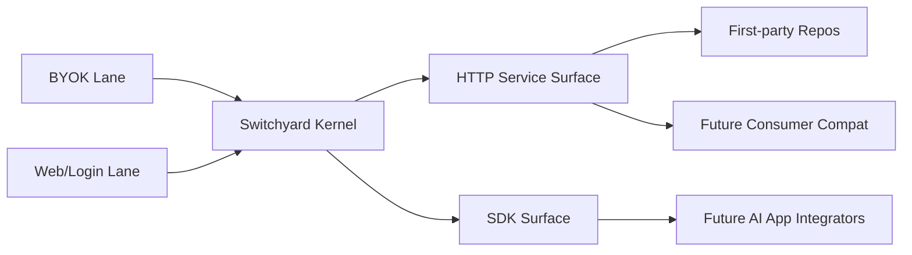

# Switchyard

**Shared provider runtime for AI apps.**

`Switchyard` 不是聊天产品，也不是 personal assistant，也不是另一个全家桶 AI 平台。  
它要做的是更纯的一层：

> **把终端用户已有的 AI 访问资格，统一收编成一个可被 AI 产品消费的共享运行时。**

## 30 秒版本

如果你现在只想先用一句人话记住它：

> **`Switchyard` 不是另一个 AI App。**
>
> **它是一层 shared provider runtime。**
>
> **它把 `BYOK + Web/Login` 这两类真实 AI 访问资格，统一变成别的 AI 产品可直接接入的 service-first substrate。**

如果你只想先读一页最短说明：

- [docs/media/30-second-overview.md](./docs/media/30-second-overview.md)

## 当前证据条

如果你现在最关心的不是愿景，而是“这仓到底是不是 PPT”，先看这 3 条：

- `repo-side gate = green`
  - `pnpm typecheck`、frontdoor/docs/distribution/MCP/CLI slice、`pnpm build` 当前都过
- fresh `verify:service-live` 当前停在 `Gemini = user-action-required`
  - 也就是说，repo 自己没先垮，但这台 credentialed workstation 上的 Gemini 会话还需要真人补一步
- `latest aggregate = external-blocker on this workspace`
  - front door 现在该同步成 `Gemini / Grok`，不再继续复读旧的 `Claude / Grok / Qwen`

## 快速入口

如果你现在只想知道“第一步该去哪”，先走这三条最短路径之一：

- 我想先用 30 秒看懂它
  - 先看 [docs/media/30-second-overview.md](./docs/media/30-second-overview.md)
- 我想跑通默认第一把成功
  - 先看 [docs/first-success.md](./docs/first-success.md)
- 我想先看它现在到底能证明什么
  - 先看 [docs/public-proof-pack.md](./docs/public-proof-pack.md)

如果你已经明确自己在走 builder / distribution 路线，再看：

- [docs/plugin-skill-starter-kits.md](./docs/plugin-skill-starter-kits.md)
- [docs/public-distribution-ledger.md](./docs/public-distribution-ledger.md)

## 治理分层

当前这仓把验证和治理分成 5 层，先把它理解成 5 道安检门：

- `pre-commit`
  - 本地最早拦截 secrets 与 frontdoor hygiene
- `pre-push`
  - 本地提交前的 coverage / test / build 总闸
- `hosted`
  - GitHub Actions 负责 repo-side 代码与合同
- `nightly`
  - hosted-safe 的定时重检查，不碰真人登录态
- `manual`
  - 只在 credentialed workstation 上处理 live/provider/browser realism

更完整的层级说明看：

- [docs/testing-pyramid.md](./docs/testing-pyramid.md)
- [docs/runbooks/dev-bootstrap.md](./docs/runbooks/dev-bootstrap.md)

这里的“访问资格”包括：

- 官方 API Key
- Web/Login / OAuth / subscription 会话
- 未来才可能进入的 agent-native 能力来源

---

## 为什么要有这个项目

很多 AI 产品都在重复做同一层脏活：

- 每个产品都重写 provider contract
- 每个产品都自己处理 auth/session/refresh
- Web/Login provider 很脆，但真实用户又经常只有订阅，没有 API Key
- provider routing、capability mapping、错误归一化、diagnostics 到处散落

`Switchyard` 要做的不是把这些能力塞回某一个产品里，而是把这层重复劳动变成：

> **一个可复用、可服务化、可被依赖的共享 Provider Runtime。**

---

## V1 范围

### V1 只做两条供给 lane

- `BYOK`
- `Web/Login`

### 固定网页登录 provider

1. `ChatGPT`
2. `Gemini`
3. `Claude`
4. `Grok`
5. `Qwen`

其中高稳定目标为：

- `ChatGPT`
- `Gemini`
- `Claude`

### BYOK 范围

真实打通：

- `Gemini API Key`

代码支持必须覆盖：

- `OpenAI`
- `Anthropic`
- `Grok / xAI`
- `OpenRouter`
- `Groq`
- `Qwen API`
- `Vertex AI`
- `Bedrock`

### 当前明确不做

- `Agent Input Lane`
- `Codex` / `Claude Code` 作为供给侧输入来源
- `Gemini CLI`
- 同 provider 多账户池化
- 平台共享凭证
- raw fork 产品
- control-plane 主线

---

## 产品边界

### 它是什么

- 面向 AI 产品开发者的共享 runtime
- 统一 provider / auth / session / diagnostics 语言
- 对外以 service/runtime API substrate 为当前主前门
- SDK/client 保留为正式消费面，但建立在同一 substrate 上

### 它不是什么

- 不是聊天产品
- 不是 channel hub
- 不是 personal assistant
- 不是 control-plane first 的 SaaS
- 不是某个上游大产品的换皮 fork

---

## 核心原则

### 1. 产品独立，技术深借

`Switchyard` 的路线不是：

- 完全闭门从零重复造轮子

也不是：

- 把强上游直接 raw fork 公开发布

而是：

> **Independent Product, Upstream-Informed Runtime**

翻成人话：

- 产品是我们的
- 技术认真向强上游学习
- 能借的借
- 该迁移的迁移
- 但公开产品身份、合同、架构语言必须是 `Switchyard` 自己的

### 2. `openclaw-zero-token` 是技术母本，不是产品母本

这条是当前最重要的战略裁决之一。

`openclaw-zero-token` 很强，尤其在 Web/Login 供给侧运行时上已经覆盖了大量最脏最难的问题。  
所以 `Switchyard` 必须深度研究它。

但这不等于：

- `Switchyard` 要变成它的变种
- `Switchyard` 要继承它的产品世界观
- `Switchyard` 要用 raw fork 方式对外存在

### 3. 用户显式控制，系统透明诊断

`Switchyard` 不靠黑盒兜底来营造“稳定错觉”。

当前默认失败策略是：

1. 明确报错
2. 明确诊断
3. 把选择权交还给用户

不做：

- 偷偷切 provider
- 偷偷换账号
- 平台暗箱 failover

### 4. API substrate first，SDK/client 保留为正式消费面

当前 truth freeze 后，repo 的公开口径统一成：

- `API substrate first`
- `service/runtime` 是当前主前门
- `SDK/client` 是正式消费面，但建立在同一 substrate 上

### 5. 凭证永远归终端用户

`Switchyard` 不拥有公共 AI 资格。  
它只处理终端用户自己带来的凭证。

---

## 当前主线参考体系

### 主线主参考

- `Vercel AI SDK`
- `LiteLLM`
- `openclaw-zero-token`

### 它们的分工

- `Vercel AI SDK`：SDK/contracts/byok abstraction 骨架
- `LiteLLM`：BYOK gateway / sidecar 样本
- `openclaw-zero-token`：Web/Login 技术母本

### 本地工作区主参考路径

当前工作区内，三大主线参考的本地路径可按占位写法记为：

- `Vercel AI SDK`
  `<local-reference-root>/ai`
- `LiteLLM`
  `<local-reference-root>/litellm`
- `openclaw-zero-token`
  `<local-reference-root>/openclaw-zero-token`

这里的 `<local-reference-root>` 指你在本机放第三方参考仓的根目录；公开文档里不要写个人绝对路径。

这里要特别强调：

> **在 Web/Login 这条 lane 上，`openclaw-zero-token` 不是“众多参考之一”，而是当前最重要的技术母本。**
>
> 它不是产品母本，但它是当前最值得深度研究、模仿、拆解、迁移的上游运行时来源。

### 次级或边缘参考

- `ChatALL`：产品壳 / 能力矩阵样板
- `codex`、`claude-code`、`openclaw`：后续 consumer compat 参考

---

## 架构方向

当前正式采用的骨架原则是：

- `lane`
- `provider`
- `consumer`
- `surface`

四层拆开。

高层关系可以先这样理解：



这里最重要的不是图本身，而是它表达的顺序：

- 先把供给侧两条 lane 做稳
- 再通过 service/SDK 暴露统一内核
- 再让 first-party repo 接入
- 最后才进入 `Codex / Claude Code / OpenClaw` 的 compat

---

## 当前交付阶段

交付顺序已经固定：

1. `Kernel Alpha`
2. `Kernel Beta`
3. `First-party Integration`
4. `Consumer Compat`

当前仓库已经完成的是：

- 产品定义
- ADR
- contracts
- delivery blueprint
- `pnpm workspace` 基础骨架
- `Kernel Alpha` 的最小代码主干
  - `contracts / kernel / credentials / diagnostics`
  - `BYOK` baseline（含 `Gemini API Key` 真实请求路径）
  - `Web/Login` baseline（固定 5 家 provider 全部进入 runtime 路径）
  - `service surface` 与 `sdk surface` 的最小统一入口
- `Web/Login` reality tooling
  - `verify:web-login-live`
    - provider 级复验可用 `pnpm exec node scripts/verify-web-login-live.mjs --provider <provider>`
  - `verify:gemini-live`
  - `reality:gate`
  - `live-proof` 模块
- 高稳定 trio 的 acquisition 起步实现
  - `ChatGPT`
  - `Gemini`
  - `Claude`

当前还没有全部进入 full-support / full-parity 主线的，是：

- `LiteLLM` / `openclaw-zero-token` 的 sidecar labs 深化
- 更大范围的 first-party expansion
- full consumer compat parity

---

## 仓库现状

当前仓库已经不再是“只有文档、还没开工”的状态。  
而且在当前这台 workspace 上，它也已经可以被更诚实地描述成：

> **repo-side gate 已经站稳。**
>
> **但 latest live truth 仍然是 workstation-bound，而且这次 fresh rerun 仍然停在 3 个 external blockers。**

当前更准确的阶段是：

> **`Switchyard` 的 fresh internal gate 仍然站得住。**
>
> **但 latest fresh rerun in this workspace 已经不该继续写成 `Claude / Grok / Qwen`。**
>
> **当前 frontdoor 应同步成：repo-side green；fresh `verify:service-live` 当前停在 `Gemini = user-action-required`；workspace external blocker pack 用 `Gemini / Grok`。**
>
> **但这仍然是 environment-bound truth：换机器、换浏览器会话、换凭证材料以后，依然要重新跑 live gate。**

这不是跳过 docs-first，而是按 docs-first 的顺序往前走了一步：

> 先把“我们到底要做什么”写成合同，  
> 再用最小但真实的代码把内核立起来。

这样做的好处是：

- 后续 Agent 不需要边做边猜
- 代码和合同已经开始互相校验
- 参考仓不会反客为主
- 目录不会长歪
- 范围不会失控

### 当前 live reality（truth-first 说明）

这里必须把两层真相拆开写，不然很容易把某次带凭证的 closeout 结果误读成 repo 常量：

- **repo 内部真相**
  - `pnpm typecheck`
  - `pnpm test`
  - `pnpm build`
  这些 internal gate fresh 通过时，只说明仓内代码、测试、构建链是站得住的。
- **live 环境真相**
  - `pnpm run verify:gemini-live`
  - `pnpm run verify-web-login-live`
  - `pnpm run verify:service-live`
  - `pnpm run reality:gate`
  这些 live gate 永远依赖**当前这台机器上的终端用户凭证、cookie bundle、browser user agent、已登录浏览器会话**，所以不是 repo 常量。

当前最关键的现实点是：

- `apps/service/src/web-auth-acquisition.ts` 已经把 5 家 `Web/Login` provider 接进 local-first acquisition 主线
- `verify:web-login-live`、`verify:gemini-live`、`reality:gate` 都已存在且能 fresh 复验
- 当前这轮 **latest fresh rerun in this workspace** 说明的，不是“内部有没有做完”，而是“当前这台机器上还缺哪些 live/browser 材料”
- 当前 Program L1 的 fresh repo-side rerun 已确认：
  - `pnpm typecheck` = 0
  - `pnpm exec vitest run tests/integration/docs/frontdoor-docs.test.ts tests/integration/docs/package-ready-distribution.test.ts tests/unit/mcp/switchyard-mcp.test.ts tests/unit/web/switchyard-cli.test.ts --config vitest.config.ts` = 0
    - `5 files / 43 tests passed`
  - `pnpm build` = 0
  - `pnpm run reality:gate` = `2`
  - 当前 latest fresh aggregate closeout：
    - `pnpm run verify:service-live` = `0`
    - `overallStatus = external-blocker`
    - `internalGate.passed = true`
    - `successCount = 3`
    - `externalBlockerCount = 3`
    - `failureCount = 0`
    - current external blockers:
      - `Claude` = `missing-web-session-material`
      - `Grok` = `missing-web-session-material`
      - `Qwen` = `missing-web-session-material`
- 当前 fresh 已确认：
  - `Gemini BYOK` 已经成功
  - `ChatGPT` provider-scoped live proof 当前 success
  - `Gemini` provider-scoped live proof 当前 success
  - `verify:service-live` 当前也已成功
  - 当前这台 workspace 上，top-level program 不是 internal blocker，但 aggregate closeout 仍停在 3 个外部网页登录材料缺口
  - `auth-status ready` 仍然只说明本地材料在，不自动替代 future live rerun

更重要的一点：

> **当前 live repo 已经不是“文档好了但代码没站起来”。**
>
> **今天更稳、更诚实的说法是：repo-side gate 已经过闸；fresh service-first spot check 当前停在 `Gemini = user-action-required`；workspace external blocker pack 现在该写成 `Gemini / Grok`。**
>
> **也就是说，当前 program 不是卡在内部工程债，而是 paused 在一组 workstation-bound external blockers。**
>
> **但环境边界仍然成立：未来接手者如果换了机器、换了浏览器会话、换了凭证材料，仍然必须重新跑 live gate，而不是把这次 green 当成永久常量。**

同时要保留一个工程护栏：

> **所有 live 结论都是时间片真相。**
>
> README 里的这段说明只负责解释“为什么 live gate 不是 repo 常量”，不替代你下一次接手时重新运行：
> - `pnpm run verify:gemini-live`
> - `pnpm run verify-web-login-live`
> - `pnpm run verify:service-live`
> - `pnpm run reality:gate`
>
> **它也不覆盖更高优先级的 ADR / blueprint / task board。**
>
> 当前这些更高优先级工件需要同步到同一个更诚实的结论：当前顶层 program 状态仍然是 `PROGRAM PAUSED - ONLY TRUE EXTERNAL BLOCKERS REMAIN`，原因不是内部工程漂移，而是当前这台 workspace 的 blocker pack 该写成 `Gemini / Grok`，而且它们都属于 workstation-bound external blockers。

同时补一个当前工程现实：

> 当前仓里已经存在一片新的 `service/runtime substrate` 稳定化证据：
> - `verify:service-live`
> - BYOK lane 通过统一 service runtime 入口暴露
> - SDK 也可以围绕同一 service entrypoint 提供 client
>
> 更诚实的当前写法应该是：**repo-side substrate 已经站住，但 current workspace live truth 仍 paused 在一组外部 browser/session blockers。**
> 说得更直白一点：地基已经打牢，真正没过线的不是 repo 自己，而是当前这台机器上 `Gemini / Grok` 还没有把真人登录后的 browser/session 状态稳定收口成可复验的 live proof。

如果你需要把 `store-ready != live-ready` 看得更具体一点，现在有一条专门的 browser diagnose 工具：

```bash
pnpm run diagnose:web-login-browser -- --provider chatgpt --reload --json
```

它会：

- 读取本地 auth store 的 session truth
- 连接 canonical browser attach target
- 输出 `current-page / current-console / current-network`
- 写一份 support bundle 到 `.runtime-cache/browser-support/`

这条命令的意义可以先这样理解：

> `auth-status ready` 像是“钥匙已经放进抽屉里”。  
> `live-ready` 则是“人真的已经站在正确的房门前，而且门把手能转开”。

## Repo-local Runtime Artifacts

如果你想知道这个仓本地到底会留下哪些运行时副产物，可以先把它理解成：

- `managed-browser-profile`
  - `.runtime-cache/switchyard-web-auth-browser`
  - 这是 `Switchyard` 自己的 managed browser 工位，不是普通可随手丢掉的临时文件
- `debug-evidence`
  - `.runtime-cache/browser-debug/bundles`
  - 这里放的是 `current-page.png` / `summary.json` 这类调试证据
- `support-bundles`
  - `.runtime-cache/browser-support`
  - 这里放 provider support bundle，默认会参与 TTL / 容量治理，但不会跑到 repo 外的任意位置
- `disposable-generated`
  - `.runtime-cache/temp`
  - 这里放 live proof / service proof 这种可重建的临时编译产物

可以把这些资产先看成一张“归属表”：

| 资产类型 | 默认位置 | 会不会自动治理 | 说明 |
| :--- | :--- | :--- | :--- |
| repo-local runtime artifacts | `.runtime-cache/` | 会 | 当前 repo 自己的 support bundle / debug bundle / temp proof / managed fallback 都尽量收进这里 |
| repo-external dedicated cache | `~/.cache/switchyard/` | 会 | 只允许放当前 repo 专属的外部临时缓存 |
| 真实 Chrome Profile `switchyard` | Chrome 用户数据目录 | 不会 | 这是用户资产，不是 repo cache |
| 共享工具缓存 | `pnpm store` / `~/.npm` / `~/Library/Caches/ms-playwright` / `.serena/cache` 等 | 不会 | 不属于本仓自动清理面 |

repo 外如果真的需要放当前仓专属的临时缓存，也只能落在：

- `~/.cache/switchyard`

说得更直白一点：

> repo 内可清理运行时资产，尽量统一进 `.runtime-cache/`。
> repo 外专属临时缓存，只允许进 `~/.cache/switchyard/`。
> `~/.npm`、`pnpm store`、`~/Library/Caches/ms-playwright`、`.serena/cache` 这些共享工具缓存，不属于本仓自动清理面。
> `.serena/` 本身属于本机 MCP 缓存，保持 ignore，不纳入当前仓 runtime 治理。

现在仓里有一条 repo-native 的体检和清理入口，会同时审计：

- repo-local `.runtime-cache/`
- repo-external `~/.cache/switchyard`

默认治理规则是：

- TTL = `7 days`
- max bytes = `5 GiB`
- 清理优先级
  - 先删 `temp`
  - 再删旧 debug / support bundles
  - 再删 repo-external disposable browser artifacts
  - 最后才允许显式 `--include-managed-browser`

```bash
pnpm run audit:runtime-footprint
pnpm run cleanup:runtime -- --dry-run
```

可以先这样理解：

> `audit:runtime-footprint` 像盘库存。  
> `cleanup:runtime -- --dry-run` 像先拿清单和彩色贴纸演练一遍，不真的扔东西。

如果你真的要动高风险那一档，也必须显式写出来：

```bash
pnpm run cleanup:runtime -- --apply --include-managed-browser
```

这条命令不会碰 machine-wide 临时目录、Docker 全局缓存、`~/.npm`、`pnpm store` 或 Chrome 的用户资产。
它只治理当前 repo 自己的 `.runtime-cache/`，再加上专属的 `~/.cache/switchyard/`。
它也会回收 verifier / writeback 在 `.runtime-cache/switchyard-*` 下留下的临时 auth-store 工作目录，以及 repo-local 的 app-service / reality-gate 日志报告，避免把 browser/session 副本和调试日志长期堆在 repo 内。
其中 `~/.cache/switchyard/browser/chrome-user-data` 是当前 repo 的永久浏览器工位，不参与 TTL / cap 自动裁剪。

## Credentialed Browser Mode

这仓现在把本地 credentialed 浏览器开发默认理解成：

- **默认本地入口**
  - `isolated-chrome-root`
- **repo 专属独立 Chrome 根目录**
  - `~/.cache/switchyard/browser/chrome-user-data`
  - steady-state 只保留一个 repo-owned 实例
  - 缺席则启动，存在则 attach，不 second-launch
- **repo-local managed fallback**
  - `.runtime-cache/switchyard-web-auth-browser`
  - 只保留成显式 opt-in 的隔离 fallback
- **默认 Chrome 根目录**
  - 只在一次性 seed / reseed 时读取
  - 不再作为 steady-state 工作工位

推荐的本地配置长这样：

```bash
export SWITCHYARD_BROWSER_MODE=isolated-chrome-root
export SWITCHYARD_CHROME_USER_DATA_DIR="$HOME/.cache/switchyard/browser/chrome-user-data"
export SWITCHYARD_CHROME_PROFILE_NAME="switchyard"
export SWITCHYARD_EXTERNAL_CACHE_ROOT="$HOME/.cache/switchyard"
export SWITCHYARD_CACHE_TTL_DAYS=7
export SWITCHYARD_CACHE_MAX_BYTES=5368709120
export SWITCHYARD_WEB_AUTH_EXISTING_PROFILE_CDP_URL="http://127.0.0.1:9338"
```

如果你不想手抄，直接把这组变量从仓里的 `.env.example` 拿过去，再按你自己的机器路径改就行。

第一次把默认 Chrome 根目录里的 `switchyard` profile 搬到 repo 专属根目录时，用这组命令：

```bash
pnpm run seed:isolated-chrome-root -- --json
# 只有你明确想重建独立根目录时才用：
pnpm run reseed:isolated-chrome-root -- --json
```

这里有个很重要的边界：

> `Switchyard` 现在的 steady-state 浏览器工位不是默认 Chrome 根目录里的公共房间。
> 它是 repo 专属的独立根目录：`~/.cache/switchyard/browser/chrome-user-data`。
> 这套根目录是**永久工位**，不是 disposable cache，不会被 TTL / cap 自动清掉。

同时也明确一条 fail-closed 规则：

- steady-state 不再默认猜测任意全局 Chrome user-data-dir
- 默认 Chrome 根目录只用于显式 seed / reseed
- 本地 credentialed 调试默认走 repo 专属独立 Chrome 根目录
- 当前 repo 的 canonical isolated-root CDP 端口 = `9338`
- 只有隔离 fallback 或无状态路径才走 repo-local managed browser

还有一条这轮补上的宿主机安全边界：

> `Switchyard` 的 browser bootstrap 不再通过 `detached: true` + `.unref()` 留下一个游离的 Chrome child handle。
> 新实例启动必须走宿主机 launcher handoff；已在线的 repo-owned 浏览器如果要补开登录页，必须走 CDP `/json/new`。
> 如果当前宿主机没法证明这条 handoff 安全成立，就要 fail-closed，改用 `Attach Existing Browser Session`，而不是偷偷退回 detached launch。

还有一条这轮新增的真实性规则：

> `ready` 现在不再只是“曾经 capture 成功过一次”。  
> 它更接近“当前 local auth store、当前 attached browser、以及当前 browser root 上的关键持久 cookie 仍然彼此一致”。

说得更直白一点：

- store 里还记着旧材料
- 但当前浏览器页已经掉到登录页
- 或当前 root 上关键 session cookie 根本没落盘

这种情况以后不会再被继续包装成 `ready`。

## Docker Boundary

当前 `Switchyard` 没有 repo-owned Docker runtime。

- 这轮不会把 Docker 拉进当前缓存治理面
- `cleanup:runtime` 也不是 machine-wide Docker 清盘命令
- 如果未来引入 Docker sidecar / 容器 / volume / network
  - 必须同步补 repo-native cleanup policy
  - 只能清理明确带 `switchyard` 归属的资源
  - 禁止 machine-wide destructive prune

## CI Boundary

当前仓继续只用 GitHub Hosted Runner。

- `.github/workflows/ci.yml`
  - `runs-on: ubuntu-latest`
- `.github/workflows/security.yml`
  - `runs-on: ubuntu-latest`
- repository code scanning default setup
  - `runner_type: standard`

云端 CI 当前只负责 repo-side gate：

- `pnpm typecheck`
- `pnpm test`
- `pnpm build`
- security / repository code scanning

而下面这些属于 **local credentialed only**：

- `pnpm run verify:gemini-live`
- `pnpm run verify-web-login-live`
- `pnpm run verify:service-live`
- `pnpm run reality:gate`
- `pnpm run diagnose:web-login-browser`
- `pnpm run capture:web-debug-bundle`

如果在 CI 里误触发这些 live 路径，现在会 fail-closed，直接报 `credentialed-workstation only`，而不是偷偷去依赖云端没有的本地 Profile / 登录态。

## Public Surface Status

如果你现在只想知道“哪些窗口开着、哪些还在装修”，直接看这两页：

- [docs/public-surface-support-matrix.md](docs/public-surface-support-matrix.md)
- [docs/public-surface-catalog.md](docs/public-surface-catalog.md)
- [docs/public-distribution-ledger.md](docs/public-distribution-ledger.md)
- [docs/blueprints/openclaw-zero-token-adoption-ledger.md](docs/blueprints/openclaw-zero-token-adoption-ledger.md)

最短版结论是：

- `Switchyard for Codex` = `partial / thin compat landed / not full parity`
- `Switchyard for Claude Code` = `partial / thin compat landed / not full parity`
- `Switchyard for OpenClaw` = `partial / thin compat landed / not full parity`
- `HTTP / API` = `supported now`
- `SDK/client` = `partial`
- `CLI` = `partial`
- `MCP` = `partial / read-only server-tool surface landed / not execution brain`
- `Codex / Claude Code / OpenClaw compat` = `partial`
- `i18n` = `partial`

## Developer Frontdoor

如果你是第一次来看这个仓，先别一下打开下面整排目录柜。

先按这个顺序走，会更接近“先点火，再开地图”：

1. [docs/media/30-second-overview.md](docs/media/30-second-overview.md)
   - 30 秒先搞懂 `Switchyard` 是什么，不是什么
2. [docs/first-success.md](docs/first-success.md)
   - 当前最短默认成功路径：先把 service/runtime 跑起来，再做第一把 bounded invoke / inspect
3. [docs/public-proof-pack.md](docs/public-proof-pack.md)
   - 当前这仓到底已经能证明什么、哪些只是 partial、哪些还受 workstation 边界约束
4. [docs/README.md](docs/README.md)
   - 再回完整 docs frontdoor，按目标深入

如果你已经知道自己要做什么，再打开下面这批文档：

- [docs/README.md](docs/README.md)
  - 文档总入口 / docs frontdoor
- [docs/media/30-second-overview.md](docs/media/30-second-overview.md)
  - 30 秒版本的产品身份、可证明事实和非目标
- [docs/first-success.md](docs/first-success.md)
  - 默认 first-success 路径 / 先点火再扩展
- [docs/public-proof-pack.md](docs/public-proof-pack.md)
  - 当前 proof、最小 smoke、allowed claims / forbidden overclaim
- [docs/api/service-http-reference.md](docs/api/service-http-reference.md)
  - 当前 committed 的 HTTP runtime routes、`/v1/runtime/auth-portal`、以及 service-first 调试入口
- [docs/api/openapi.yaml](docs/api/openapi.yaml)
  - machine-readable OpenAPI contract for the current HTTP runtime surface
- [docs/api/sdk-quickstart.md](docs/api/sdk-quickstart.md)
  - 当前 committed 的 SDK / service client quickstart
- [docs/api/mcp-readonly-server.md](docs/api/mcp-readonly-server.md)
  - 当前 committed 的 read-only MCP server starter
- [docs/public-surface-support-matrix.md](docs/public-surface-support-matrix.md)
  - 当前公开 surface 的 truth table；local-only thin starters 会单独标明还没 Git-closed
- [docs/public-surface-catalog.md](docs/public-surface-catalog.md)
  - plugin / skills / builder tooling 可直接读取的 machine-readable catalog
- [docs/public-distribution-ledger.md](docs/public-distribution-ledger.md)
  - 当前 package-ready / starter-pack-ready / official-listing-not-claimed 的上架账本
- [docs/public-surface-catalog.schema.json](docs/public-surface-catalog.schema.json)
  - public surface catalog 的 machine-readable contract schema
- [docs/plugin-skill-starter-kits.md](docs/plugin-skill-starter-kits.md)
  - plugin / skills builder 从哪条窄路开始接的 starter-kit 说明书
- [docs/starter-manifest-templates.md](docs/starter-manifest-templates.md)
  - copy-paste 级 starter manifest 模板
- [docs/starter-manifest-templates.schema.json](docs/starter-manifest-templates.schema.json)
  - starter manifest 模板的 machine-readable schema
- [docs/starter-manifest-examples.md](docs/starter-manifest-examples.md)
  - runnable starter examples / 可直接照着改的例子
- [docs/starter-manifest-examples.schema.json](docs/starter-manifest-examples.schema.json)
  - starter manifest examples 的 machine-readable schema
- [examples/README.md](examples/README.md)
  - 真正能直接跑起来的 starter mini-projects / 样板间
- [starter-packs/README.md](starter-packs/README.md)
  - 按目标拆好的 copy-ready starter packs / 可复制的整包样板
- [docs/starter-pack-index.md](docs/starter-pack-index.md)
  - starter-packs 的 machine-readable 总目录
- [docs/starter-pack-chooser.md](docs/starter-pack-chooser.md)
  - 回答“我该先拿哪个 pack 开始”的 chooser / decision frontdoor
- [docs/starter-pack-comparison.md](docs/starter-pack-comparison.md)
  - 回答“这些 pack 并排看差在哪、该怎么按约束筛选”的 comparison / filter frontdoor
- [docs/builder-journeys.md](docs/builder-journeys.md)
  - 回答“如果我是某类 builder，我该沿哪一条完整路径走到 first success”的 journey frontdoor
- [docs/builder-intent-router.md](docs/builder-intent-router.md)
  - 回答“我现在这个问题第一站该去哪”的 builder intent router
- [docs/host-integration-playbooks.md](docs/host-integration-playbooks.md)
  - 回答“选完之后怎么接进宿主环境”的 host integration frontdoor
- [docs/host-integration-examples.md](docs/host-integration-examples.md)
  - 给出 host-local config 长什么样的 copy-paste examples
- [docs/provider-runtime-catalog.md](docs/provider-runtime-catalog.md)
  - provider / lane / authMode / stability 的静态目录
- [docs/provider-runtime-catalog.json](docs/provider-runtime-catalog.json)
  - machine-readable provider runtime directory
- [docs/provider-runtime-catalog.schema.json](docs/provider-runtime-catalog.schema.json)
  - schema for the machine-readable provider runtime directory
- [docs/compat-target-catalog.md](docs/compat-target-catalog.md)
  - dedicated thin compat target directory
- [docs/compat-target-catalog.json](docs/compat-target-catalog.json)
  - machine-readable compat target directory
- [docs/compat-target-catalog.schema.json](docs/compat-target-catalog.schema.json)
  - schema for the machine-readable compat target directory
- [docs/builder-kit-catalog.md](docs/builder-kit-catalog.md)
  - dedicated builder kit directory
- [docs/builder-kit-catalog.json](docs/builder-kit-catalog.json)
  - machine-readable builder kit directory
- [docs/builder-kit-catalog.schema.json](docs/builder-kit-catalog.schema.json)
  - schema for the machine-readable builder kit directory
- [docs/skill-pack-catalog.md](docs/skill-pack-catalog.md)
  - dedicated skill pack directory
- [docs/skill-pack-catalog.json](docs/skill-pack-catalog.json)
  - machine-readable skill pack directory
- [docs/skill-pack-catalog.schema.json](docs/skill-pack-catalog.schema.json)
  - schema for the machine-readable skill pack directory
- [docs/mcp-tool-catalog.md](docs/mcp-tool-catalog.md)
  - dedicated read-only MCP tool directory
- [docs/mcp-tool-catalog.json](docs/mcp-tool-catalog.json)
  - machine-readable MCP tool directory
- [docs/mcp-tool-catalog.schema.json](docs/mcp-tool-catalog.schema.json)
  - schema for the machine-readable MCP tool directory
- [docs/blueprints/m2-kernel-beta-verdict.md](docs/blueprints/m2-kernel-beta-verdict.md)
  - 当前 `M2 / Kernel Beta` 的 fresh honest verdict
- [docs/blueprints/m3-first-party-integration-readiness.md](docs/blueprints/m3-first-party-integration-readiness.md)
  - 当前 `M3` 只允许进入 readiness package，不允许偷跑实施
- [docs/blueprints/wave4-consumer-contract-freeze.md](docs/blueprints/wave4-consumer-contract-freeze.md)
  - `Wave 4` thin compat contract freeze
- [docs/blueprints/openclaw-zero-token-adoption-ledger.md](docs/blueprints/openclaw-zero-token-adoption-ledger.md)
  - `openclaw-zero-token` 技术吸收状态账本
- [docs/api/error-diagnostics-reference.md](docs/api/error-diagnostics-reference.md)
  - error / diagnostics frontdoor
- [docs/api/web-login-acquisition.md](docs/api/web-login-acquisition.md)
  - Web/Login acquisition route reference
- [docs/runbooks/dev-bootstrap.md](docs/runbooks/dev-bootstrap.md)
  - 如果你要处理 Web/Login builder first success，这里是 browser / auth-portal / runtime hygiene 的最快入口
- [docs/compat/codex.md](docs/compat/codex.md)
  - `Switchyard + Codex` 当前 truth
- [docs/compat/claude-code.md](docs/compat/claude-code.md)
  - `Switchyard + Claude Code` 当前 truth
- [docs/compat/openclaw.md](docs/compat/openclaw.md)
  - `Switchyard + OpenClaw` 当前 truth
- [packages/consumers/codex/README.md](packages/consumers/codex/README.md)
  - `@switchyard/consumer-codex` 的 package-ready frontdoor
- [packages/consumers/claude-code/README.md](packages/consumers/claude-code/README.md)
  - `@switchyard/consumer-claude-code` 的 package-ready frontdoor
- [packages/consumers/openclaw/README.md](packages/consumers/openclaw/README.md)
  - `@switchyard/consumer-openclaw` 的 package-ready frontdoor
- [packages/surfaces/mcp/README.md](packages/surfaces/mcp/README.md)
  - `@switchyard/surface-mcp` 与 `switchyard-mcp` bin 的 package-ready frontdoor
- [docs/compat/README.md](docs/compat/README.md)
  - compatibility matrix frontdoor
- [docs/mcp.md](docs/mcp.md)
  - `Switchyard + MCP` 当前 truth
- [docs/glossary.md](docs/glossary.md)
  - bilingual glossary / 双语术语表
- [docs/i18n.md](docs/i18n.md)
  - bilingual developer surface status
- [docs/testing-pyramid.md](docs/testing-pyramid.md)
  - test pyramid / gates / coverage philosophy
  - `pnpm run test:coverage` is the stable gating path for `text-summary` + `coverage/coverage-summary.json`
  - `pnpm run test:coverage:html` is the optional local HTML report path
- [docs/discoverability-keyword-truth.md](docs/discoverability-keyword-truth.md)
  - truthful keyword capture table
- [docs/discoverability-keyword-truth.json](docs/discoverability-keyword-truth.json)
  - machine-readable keyword truth table for docs / SEO tooling
  - if you only need keyword-claim truth, start here
- [docs/discoverability-keyword-truth.schema.json](docs/discoverability-keyword-truth.schema.json)
  - schema for the machine-readable keyword truth table
- [docs/builder-intent-router.json](docs/builder-intent-router.json)
  - machine-readable first-hop router for builder questions
- [docs/builder-intent-router.schema.json](docs/builder-intent-router.schema.json)
  - schema for the machine-readable builder intent router
- [docs/faq.md](docs/faq.md)
  - 常见问题 / planned vs supported
- [docs/shared-provider-runtime.md](docs/shared-provider-runtime.md)
  - `shared provider runtime` / `AI app backend` frontdoor
- [docs/compare/byok-vs-web-login.md](docs/compare/byok-vs-web-login.md)
  - `BYOK + Web/Login` 为什么都要做
- [docs/compare/switchyard-vs-codex.md](docs/compare/switchyard-vs-codex.md)
  - `Switchyard vs Codex`
- [docs/compare/switchyard-vs-claude-code.md](docs/compare/switchyard-vs-claude-code.md)
  - `Switchyard vs Claude Code`
- [docs/compare/switchyard-vs-openclaw.md](docs/compare/switchyard-vs-openclaw.md)
  - `Switchyard vs OpenClaw` 的 truth-first 比较

---

## 阅读顺序

如果你是第一次进入这个仓，建议从这里开始：

1. `docs/product/v1-brief.md`
2. `docs/product/scope-and-nongoals.md`
3. `docs/adr/0001-v1-boundary-and-lane-model.md`
4. `docs/adr/0002-external-repo-adoption-matrix.md`
5. `docs/adr/0003-upstream-relationship-openclaw-zero-token.md`
6. `docs/adr/0004-architecture-skeleton-monorepo.md`
7. `docs/contracts/provider-runtime-contract.md`
8. `docs/contracts/auth-accounts-and-credentials.md`
9. `docs/contracts/service-and-sdk-surfaces.md`
10. `docs/blueprints/v1-delivery-plan.md`

---

## 现在最重要的一句话

> `Switchyard` 不试图做一个更大的 `openclaw-zero-token`。  
> 它要做的是：
> **一个更纯粹、更适合被 AI 产品依赖和服务化接入的共享 Provider Runtime。**

---

## Security

- 安全漏洞请优先通过 GitHub Security Advisories / private vulnerability reporting 提交。
- 不要在公开 issue 里贴出 cookie bundle、session artifact、browser profile 路径或其他凭证材料。
- 当前本地运行时状态目录如 `.runtime-cache/`、`.agents/`、`.env*` 都不应进入远端发布面。

更多细节见 [SECURITY.md](SECURITY.md)。

补充一条本地运维边界：

- repo-local cleanup 只允许作用在当前仓的 `.runtime-cache/`
- 不要把 `cleanup:runtime` 误当成 machine-wide 清磁盘命令
- `managed-browser-profile` 默认受保护；只有显式传 `--include-managed-browser` 才会尝试删除

## License

本项目使用 [MIT License](LICENSE)。

这句话，就是当前这个仓最核心的产品存在理由。
