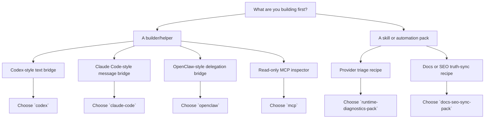

# Switchyard Starter Pack Chooser

如果你现在脑子里只有一句话：

> **“我到底该先选哪个 starter pack？”**

那这页就是给你的。

说得更直白一点：

- `starter-packs/README.md` 像货架总览
- `docs/starter-pack-index.md` 像仓库总平面图
- 这页则像门口导购台

它的任务不是发明新能力，而是把 **已经 landed 的 pack** 重新组织成一个更容易选路的前门。

## Machine-readable Source

- [docs/starter-pack-chooser.json](./starter-pack-chooser.json)
- [docs/starter-pack-chooser.schema.json](./starter-pack-chooser.schema.json)

## Read-only CLI Access

```bash
pnpm run switchyard:cli -- starter-pack-chooser
pnpm run switchyard:cli -- starter-pack-chooser-schema
pnpm run switchyard:cli -- starter-pack-scenario --target codex-builder
pnpm run switchyard:cli -- starter-pack-scenario --target docs-seo-sync-skill
```

## Read-only MCP Access

- `switchyard.catalog.starter_pack_chooser`
- `switchyard.catalog.starter_pack_chooser_schema`
- `switchyard.catalog.starter_pack_scenario`

## Quick Pick

| If your first job is... | Choose this pack | Why | Do not expect |
| --- | --- | --- | --- |
| Bridge Codex-style text requests into Switchyard | `codex` | Thin Responses-style runtime bridge | tool execution parity / MCP parity / worktree parity |
| Bridge Claude Code-style message payloads | `claude-code` | Thin message/runtime bridge | terminal shell parity / approval parity / tool parity |
| Keep OpenClaw-style delegation without copying the product shell | `openclaw` | Delegation-first bridge with product boundary intact | operator parity / product-shell parity |
| Inspect runtime truth through MCP | `mcp` | Read-only runtime inspector over stdio | execution brain / runtime invoke through MCP |
| Build a provider triage recipe | `runtime-diagnostics-pack` | Read-only diagnostics and support-bundle recipe | invoke / acquisition write / browser automation |
| Sync docs or SEO wording to truthful labels | `docs-seo-sync-pack` | Discoverability helper with human review built in | marketing autopilot / launch automation |

## Decision Flow



## Human Rule Of Thumb

你可以先用一句大白话来记：

- **要接别的工具进来**，大概率先看 builder pack
- **要做诊断或文档同步配方**，大概率先看 skill pack

再往下细分：

- 想接 `Codex` 风格文本请求：看 `codex`
- 想接 `Claude Code` 风格消息：看 `claude-code`
- 想保留 delegation-first 形状：看 `openclaw`
- 想让 MCP client 只读地看运行时真相：看 `mcp`
- 想做 provider triage recipe：看 `runtime-diagnostics-pack`
- 想做 docs / SEO truth sync：看 `docs-seo-sync-pack`

如果你已经把 pack 选好了，下一句问题通常就会变成：

> **“那我接进宿主环境的时候，第一步怎么走？”**

这时不要停在 chooser，继续往下走：

- 先看 [docs/host-integration-playbooks.md](./host-integration-playbooks.md)
- 如果你需要 copy-paste 的 host-local config 形状，再看 [docs/host-integration-examples.md](./host-integration-examples.md)

如果你现在不是“选一个 pack”，而是在几个 pack 之间犹豫，想先做并排比较和硬条件筛选：

- 看 [docs/starter-pack-comparison.md](./starter-pack-comparison.md)
- `pnpm run switchyard:cli -- starter-pack-comparison`
- `pnpm run switchyard:cli -- starter-pack-filter --target thin-runtime-bridges`

## What This Chooser Helps With

- first-time builder onboarding
- plugin / skills / automation discoverability
- SEO pages that answer a real search intent instead of only listing commands
- machine-readable pack selection for local tooling

## What It Does Not Mean

这张导购页不等于：

- plugin marketplace
- full Codex parity
- full Claude Code parity
- full OpenClaw parity
- MCP execution brain
- launch automation

它只是把当前已经存在的 pack truth，从“货架目录”补成“选路前门”。

## Related Pages

- [docs/plugin-skill-starter-kits.md](./plugin-skill-starter-kits.md)
- [starter-packs/README.md](../starter-packs/README.md)
- [docs/starter-pack-index.md](./starter-pack-index.md)
- [docs/starter-pack-comparison.md](./starter-pack-comparison.md)
- [docs/host-integration-playbooks.md](./host-integration-playbooks.md)
- [docs/host-integration-examples.md](./host-integration-examples.md)
- [docs/public-surface-catalog.md](./public-surface-catalog.md)
- [docs/discoverability-keyword-truth.md](./discoverability-keyword-truth.md)
