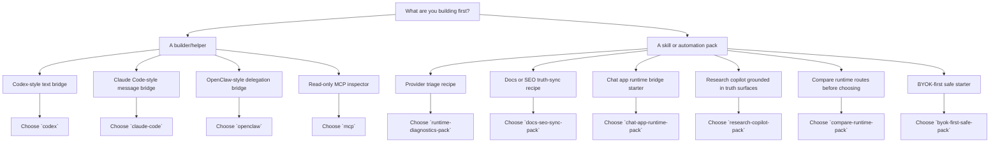

# Switchyard Starter Pack Chooser

If the only sentence in your head is:

> **Which starter pack should I pick first?**

this page is the answer.

In plain English:

- `starter-packs/README.md` is the shelf overview
- `starter-packs/index.json` is the warehouse map
- this page is the front-desk guide

It does not invent new capability. It reorganizes the packs that already exist
into a cleaner first decision.

## Machine-Readable Source

- [catalogs/starter-pack-chooser.json](../catalogs/starter-pack-chooser.json)
- [catalogs/starter-pack-chooser.schema.json](../catalogs/starter-pack-chooser.schema.json)

## Read-Only Access

```bash
pnpm run switchyard:cli -- starter-pack-chooser
pnpm run switchyard:cli -- starter-pack-chooser-schema
pnpm run switchyard:cli -- starter-pack-scenario --target codex-builder
pnpm run switchyard:cli -- starter-pack-scenario --target docs-seo-sync-skill
pnpm run switchyard:cli -- starter-pack-scenario --target chat-app-runtime-skill
```

- `switchyard.catalog.starter_pack_chooser`
- `switchyard.catalog.starter_pack_chooser_schema`
- `switchyard.catalog.starter_pack_scenario`

## Quick Pick

| If your first job is... | Choose this pack | Why | Do not expect |
| --- | --- | --- | --- |
| Bridge Codex-style text requests into Switchyard | `codex` | thin Responses-style runtime bridge | tool execution parity / MCP parity / worktree parity |
| Bridge Claude Code-style message payloads | `claude-code` | thin message/runtime bridge | terminal shell parity / approval parity / tool parity |
| Keep OpenClaw-style delegation without copying the product shell | `openclaw` | delegation-first bridge with product boundary intact | operator parity / product-shell parity |
| Inspect runtime truth through MCP | `mcp` | read-only runtime inspector over stdio | execution brain / write plane |
| Build a provider triage recipe | `runtime-diagnostics-pack` | read-only diagnostics and support-bundle recipe | invoke / acquisition write / browser automation |
| Sync docs or SEO wording to truthful labels | `docs-seo-sync-pack` | discoverability helper with human review built in | marketing autopilot / launch automation |
| Start a chat app runtime bridge without promising a full chat shell | `chat-app-runtime-pack` | service-first chat runtime starter with a bounded handoff route | full chat product scaffold / tool-using shell |
| Ground a research copilot in truth surfaces before synthesis | `research-copilot-pack` | truth-grounded research starter with human review still in the loop | autonomous research loop / citation autopilot |
| Compare runtime routes before choosing a winner | `compare-runtime-pack` | compare-first worksheet that keeps tradeoffs reviewable | automatic winner selection / benchmark autopilot |
| Stay BYOK-first with safe invoke boundaries before touching Web/Login | `byok-first-safe-pack` | safe lane-first starter for provider truth and invoke planning | key storage workflow / web-login recovery / failover promises |

## Decision Flow



## What This Page Helps With

- first-time builder onboarding
- plugin/skills/automation discoverability
- SEO pages that answer a real route-selection question
- machine-readable pack selection for local tooling

## Use-Case Skill Packs

These four are now **front-door use-case skill packs**.

They are still bounded, still partial, and still not full product shells. But
they are no longer hidden as "maybe later" shelf notes. If one of these is your
first job, it is a legitimate first-row route:

| Use case | Pick this pack | First handoff after choosing |
| --- | --- | --- |
| Service-first chat runtime bridge | `chat-app-runtime-pack` | `pnpm run switchyard:cli -- skill-pack-route --target chat-app-runtime-pack` |
| Truth-grounded research copilot | `research-copilot-pack` | `pnpm run switchyard:cli -- skill-pack-route --target research-copilot-pack` |
| Compare-first runtime or pack selection | `compare-runtime-pack` | `pnpm run switchyard:cli -- skill-pack-route --target compare-runtime-pack` |
| BYOK-first safe invoke planning | `byok-first-safe-pack` | `pnpm run switchyard:cli -- skill-pack-route --target byok-first-safe-pack` |

Once you pick one of these packs, move to
[docs/host-integration-playbooks.md](./host-integration-playbooks.md) for the
coordinated CLI + MCP handoff instead of reconstructing the route by hand.

## What It Does Not Mean

This chooser is **not**:

- a plugin marketplace
- full Codex parity
- full Claude Code parity
- full OpenClaw parity
- an MCP execution brain
- launch automation

## Related Pages

- [starter-packs/README.md](../starter-packs/README.md)
- [catalogs/starter-pack-comparison.json](../catalogs/starter-pack-comparison.json)
- [docs/host-integration-playbooks.md](./host-integration-playbooks.md)
- [docs/host-integration-examples.md](./host-integration-examples.md)
- [docs/public-surface-catalog.md](./public-surface-catalog.md)
- [docs/discoverability-keyword-truth.md](./discoverability-keyword-truth.md)
